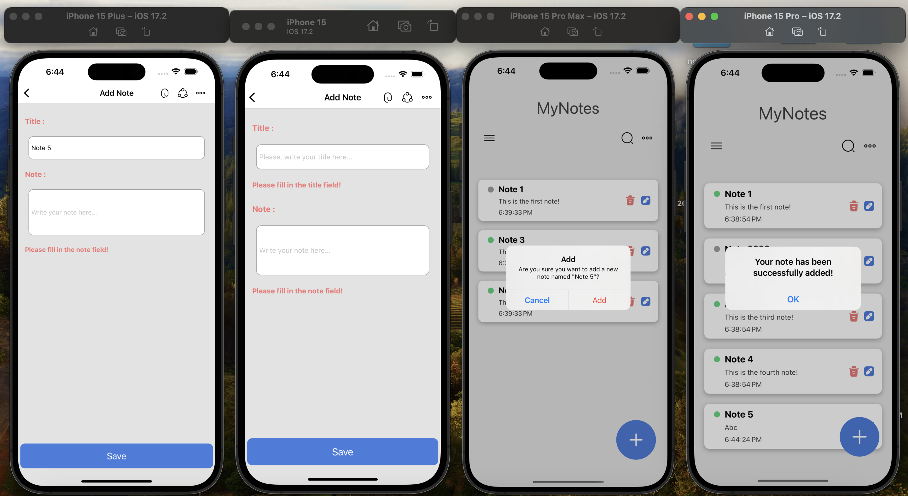

# My Note App

My Note App is a simple React Native application that allows users to manage notes. It provides functionalities for adding, updating, and deleting notes. The app utilizes React Navigation for navigation between screens, useEffect for handling the read/unread feature with color changes, and AsyncStorage for storing notes locally on the device.

# Features

- Navigation: React Navigation is used to facilitate smooth navigation between screens in the app.
- Add and Update Notes: The app allows users to add new notes or update existing ones.
- Read/Unread Functionality: Notes can be marked as read or unread, with corresponding color changes applied to indicate their status.
- Local Data Storage: AsyncStorage is employed for storing notes locally on the device, ensuring data persistence across app sessions.
- Dynamic Screen Usage: The same screen serves as both the "Add Note" and "Update Note" screens, with the header title changing based on the type of operation (add or update).
- Alert Notifications: Alert buttons are incorporated into the app for actions such as saving, deleting, or updating notes. Users are provided with informative alerts to confirm their actions.

# Usage

- Upon launching the app, users are presented with a list of existing notes.
- To add a new note, click on the "Add Note" button and fill in the details.
- To update an existing note, click on the note from the list and make the necessary changes.
- Notes can be marked as read or unread by tapping on them.
- To delete a note, swipe left on the note and click on the delete button.
- Alert buttons will provide confirmation for saving, updating, or deleting notes.

# Libraries Used

```
### React Navigation:
- React Navigation is a widely-used library for managing navigation and routing in React Native apps.
- It offers various navigation components like Stack, Tab, and Drawer Navigator for building navigation flows.
- React Navigation is highly customizable and supports both iOS and Android platforms.

### Iconsax-react-native:
- Iconsax-react-native is a library providing a collection of high-quality icons for React Native apps.
- It simplifies the integration of icons into apps by offering a convenient way to use Iconsax icons as React Native components.
- Iconsax offers a diverse range of icons covering different categories.

### React Native AsyncStorage:
- AsyncStorage is an API for storing key-value pairs asynchronously in React Native apps.
- It's commonly used for persisting small amounts of data locally on the device, such as user preferences and settings.
- AsyncStorage operates asynchronously, ensuring smooth app performance, but it's best suited for storing small data sets.

```

# SCREEN GIF


# SCREEN VIEW





# Contributing

Contributions are welcome! If you'd like to contribute to this project, feel free to fork the repository and submit a pull request with your changes.
